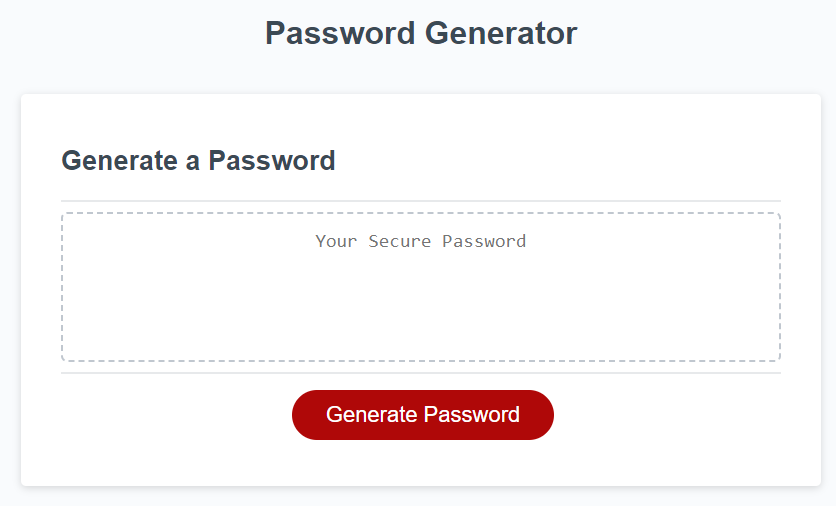
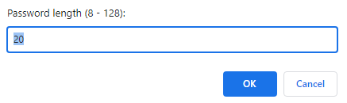

# Password Generator

## Description
This application can help you to generate the strong password. 

### What means strong password?

The key aspect of a strong assword is length, a mix of uppercase and lowercase letters, numbers, and special symbols. Letters should not be words from the dictionary and should not be connected to your personal information.

This application generate random order of letters, numbers and special symbols and allow you to choose from 8 and up to 128 charactes length.

## Usage

Link to deployed page: https://olgagav.github.io/password-generator/

To generate new password click on [ Generate Password ] button

Pop-up windows with question will help to understand your requirements to the password.

The first question is the length of password. Pleasse enter the number between 8 and 128:

Follow up with answers Yes or No what group of characters should be included in your password:
- uppercase
- lowercase
- numbers
- special characters

**Note** 
- to generate password you need to select (answer Yes) at least for one group of characters.
- by default length of password proposed 20 characters, includes all group of characters.

## Credits

Learning materials [Berkley Extension: coding bootcamp](https://extension.berkeley.edu/)

## License

n/a
